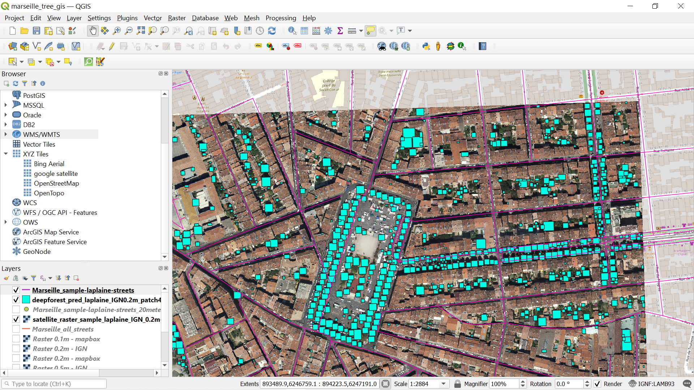

Tree challenge Marseille
========================

Objectives : finding all the trees on public land in a city

categorizing kind of tree from street view data

QGIS
====

**start by loading `marseille_tree_gis.qgz` using QGIS 3.6**



Dataset
=======

### Predictions

found in `dataset_marseille/deepforest_pred_*`

polygons generated using deepforest and `deepforest_marseille/run_predictions_geotiff.py`
also see:
`deepforest_marseille/explore predictions.ipynb` using Jupyter notebook


### Satellite Raster views

  *  IGN Geoportail (best quality - limited access)
     https://geoservices.ign.fr/blog/2017/06/28/geoportail_sans_compte.html
     > WMTS url: https://wxs.ign.fr/pratique/geoportail/wmts?SERVICE=WMTS&REQUEST=GetCapabilities

  *  Mapbox (ok quality)
     https://docs.mapbox.com/help/tutorials/mapbox-arcgis-qgis/
     > WMTS url: https://api.mapbox.com/styles/v1/mattiou/ckkl0f8zq3bzd17mqktg9mwqq/wmts?access_token=pk.eyJ1IjoibWF0dGlvdSIsImEiOiJja2trZWN6M2ExN2VqMnVwZ3liaTN0N2tjIn0.comgaQnS2e6Y6a3L_yHFfw

### Contours Quartiers
`dataset_marseille/contours_quartiers_Marseille.shp`

> Découpage administratif des 111 quartiers de Marseille (par agrégation d'IRIS).
> https://www.data.gouv.fr/fr/datasets/quartiers-de-marseille/#resource-b1e544a4-f065-494e-8012-843c6cc63cfc


deepforest predictions workflow
===============================

With QGIS 3.6 :

= Step1 : Do a geotiff raster export of map tiles =

1. right click XY layer using * Satellite Raster Views * above
2. save as : geotiff
3. deselect "Create VRT"
4. Extent : map canvas extent (just the window viewport for a sample)
5. Raster file .tif is created! - and will be added to QGIS for visualization


= Step2 : deepforest =

6. Run deepforest prediction
`python deepforest_marseille/run_predictions_geotiff.py input_geotiff_raster.tif predictions.shp`

> XXX at the moment the .py is broken but see `deepforest_marseille/explore predictions.ipynb` using jupyter notebook for working code.

7. `predictions.shp` can be added back with `Layer > Add Layer > Add Vector Layer`


deepforest install guide
========================

the conda environment to be able to run deepforest is
exported as `deepforest_conda_environment.yml`

install it with

```
conda env create -f deepforest_conda_environment.yml
```
