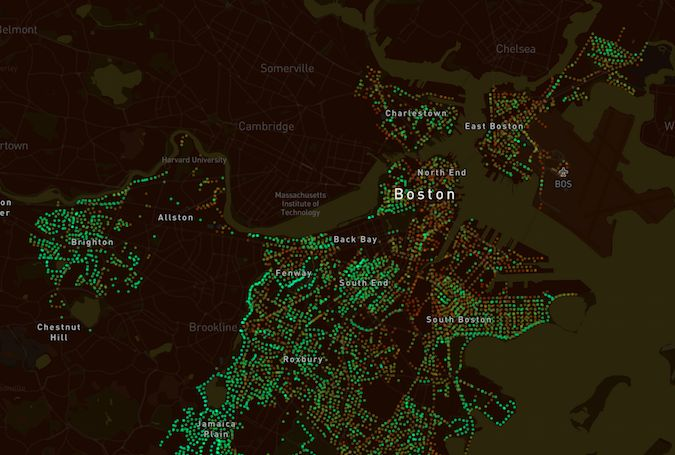
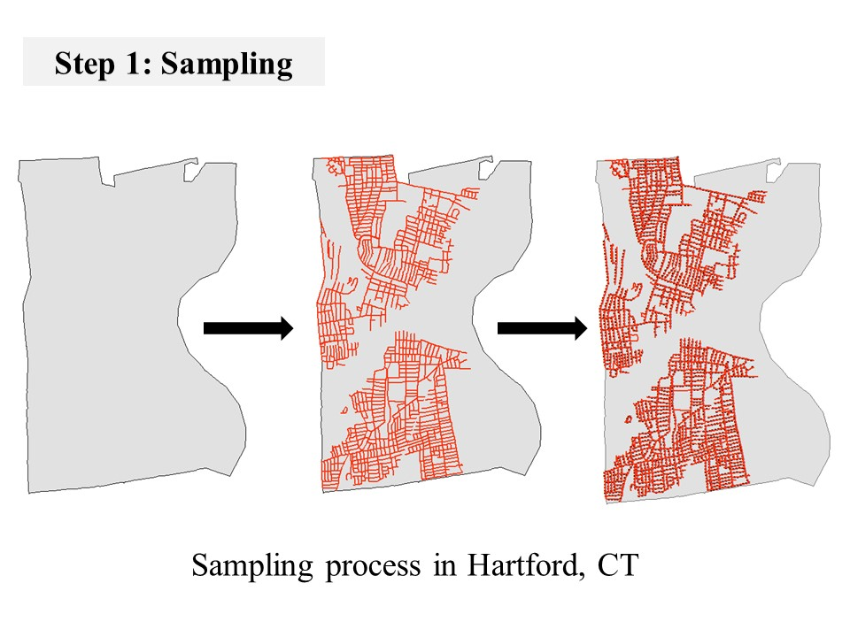
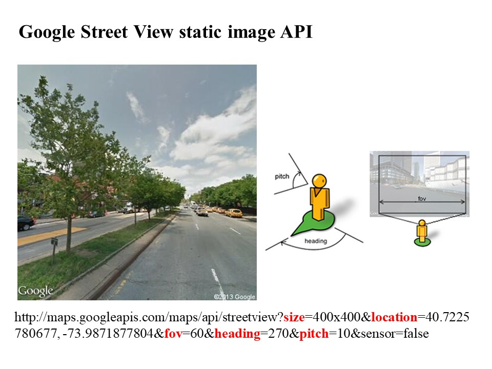
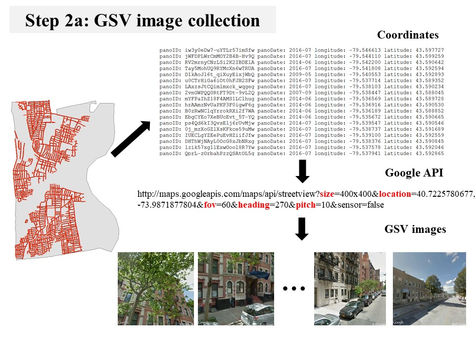
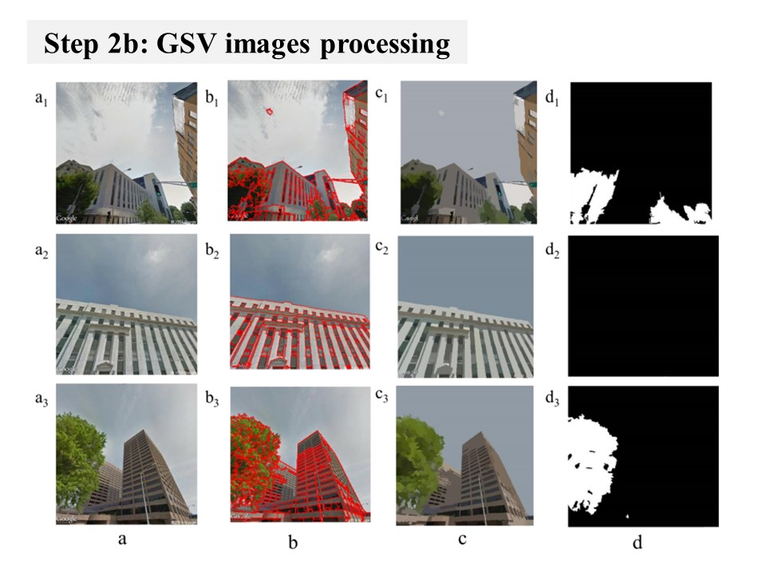

# Treepedia
Developed by the MIT [Senseable City Lab](https://senseable.mit.edu/), *Treepedia* aims to raise a proactive awareness of urban vegetation improvement, using computer vision techniques applied to Google Street View images. Our focus is on street trees: Treepedia doesn't map parks, as GSV doesn't venture into them as it does on average streets.

*Treepedia* measures and maps the amount of vegetation cover along a city's streets by computing the Green View Index (GVI) on Google Street View (GSV) panoramas. This method considers the obstruction of tree canopies and classifies the images accordingly. The GVI presented here is on a scale of 0-100, showing the percentage of canopy coverage of a particular location. Explore the maps on the [*Treepedia*](http://senseable.mit.edu/treepedia/) website to see how the GVI changes across a city, and how it compares across cities and continents.

The following repo provides a <a href="https://github.mit.edu/abdulhai/Treepedia/wiki/Analyze-Your-City"> library to implement the GVI computation</a> for a city or region defined by a boundary shapefile, given that GSV imagery is available for the street network within it. It also includes documentation of the workflow of the project so that stakeholders, municipalities, researchers or public alike may run the analysis for their cities. We will continue to grow the *Treepedia* database to span cities all over the globe. What does your green canopy look like? If you'd like to answer this question please install this python library and run the analysis for your area. 

If you are a government, researcher or stakeholder that has used this library to compute the GVI for your city and would like us to include a mapping of it on the *Treepedia* website, please contact us at: senseable-trees@mit.edu

<br />

<p align="center">
  
</p>

# Pre-requisites
- Python 3
  - You can check your python version by running the following in the Terminal.
```
python3 --version
```

- Homebrew, for Mac users. Installation guide [here](https://brew.sh)

- Google Maps API key(s) with "Street View Static API" enabled
  - To create a billing account and enable the Street View API, please refer to the official guide [here](https://developers.google.com/maps/gmp-get-started)
  - To issue API keys, read [here](https://developers.google.com/maps/documentation/streetview/get-api-key)
  - **IMPORTANT**: As API requests are billed beyond the free credit of $200 per month (per billing account), please be careful with your API keys. To find out more, refer to the section ["Using the Google Maps API"](#using-the-google-maps-api).


# Workflow 

The project has the following workflow:

## Step 0: Clone and install dependencies
- Create a virtual environment and activate it.
```
python3 -m venv ~/.Treepedia_Public
source ~/.Treepedia_Public/bin/activate
```
- Install dependencies.
```
# required for Matplotlib
brew install pkg-config freetype 

# required for Fiona
brew install gdal 
pip3 install GDAL==$(gdal-config --version | awk -F'[.]' '{print $1"."$2}')

# install dependency of PyMeanShift
pip3 install numpy==1.18.3

# download PyMeanShift (not available on PIP) and install
git clone https://github.com/fjean/pymeanshift.git
cd pymeanshift
sudo python setup.py install
cd ../

# clone Treepedia repository and install remaining dependencies using pip
git clone https://github.com/y26805/Treepedia_Public.git
cd Treepedia_Public
pip3 install -r requirements.txt
```

## Step 1: Point Sampling on Street Network of City 
With the street network and boundary shapefile for your city as input, a shapefile containing points every 20m (which can be changed depending on the size of the city) will be generated to be fed into the Google API to retrieve Google Street View Images. 

<p align="center">
  
</p>

<p align="center">
  
</p>

Note that spatial files must be in the projected WGS84 system.

```
# after changing relevant parameters in Lines 105-114
python3 Treepedia/createPoints.py
```

This function accepts three parameters: input shapefile name (`inputShp`), output shapefile name (`outputShp`) and minimum distance (`mini_dist`).

In the [example code](Treepedia/createPoints.py#L105-L114), input shape file is the `CambridgeStreet_wgs84.shp` file in the `sample-spatialdata` folder. Output file is named `Cambridge20m.shp` and the minimum distance for sampling is set to `20` meters. 


## Step 2: Metadata containing GSV panoID's

With the shapefile as input, metadata containing the panoID, panoDate, latitude, longitude and tilt specifications for the image will be stored in textfiles to be later used to calculate the Green View Index. 

<p align="center">
  
</p>

```
# after changing relevant parameters in Lines 110-120
python3 Treepedia/metadataCollector.py
```

This function accepts three parameters: input shapefile name (`inputShp`), metadata output folder (`outputTxtFolder`) and batch size (`batchNum`).

In the [example code](Treepedia/metadataCollector.py#L110-L120), input shape file is the `Cambridge20m.shp` file in the `sample-spatialdata` folder. Output folder is named `metadata` and the batch size is set to `1000`, which means the code will save metadata of every 1000 points to a txt file.
A list of the green season `greenmonth` (for example, in Cambridge, the green months are May, June, July, August, and September) is also provided.

Optionally, you can also provide `year` to retrieve panoramas that are taken in that year or older than that year. (For example, if `year` is set to 2018, only panoramas dated 2018 or before will be retrieved.)

You can generate your own sample sites based on the `createPoints.py` (Step 1) and specify a different sample site file. 


## Step 3: GVI Calculation of points with final shapefile display 
Using Otsu's method and the pymeanshift package, the Green View Index is computed for all 6 images at each sampling point; for each sampling point the GVI values are then averaged to provide a single GVI value for every point along the street network. Finally, a shapefile will be generated containing all attributes, including the GVI, of the points on the street network. 

<p align="center">
  
</p>

```
# after changing relevant parameters in Lines 297-310
# after editing keys.txt and putting your Google Maps API keys inside

python3 Treepedia/GreenView_Calculate.py
```

This function accepts four parameters: input folder containing metadata (`GSVinfoRoot`), output folder path (`outputTxtPath`), a list of the green season `greenmonth` (for example, in Cambridge, the green months are May, June, July, August, and September) and key file (`key_file`).

The [example code](Treepedia/GreenView_Calculate.py#L297-L310) is the collected metadata of GSV. By reading the metadata, this code will collect GSV images and segment the greenery, and calculate the green view index. Considering those GSV images captured in winter are leafless, which are not suitable for the analysis, you will need to specify the green season as `greenmonth` accordingly. 

You can open several process to run this code simutaniously, because the output will be saved as txt files in folder. If the output txt file is already there, then the code will move to the next metadata txt file and generate the GVI for next 1000 points.

## Step 3' GVI Calculation of points using semantic segmentation

This step is another way of calculating the green view index with a different algorithm to segment the greenery from step 3. The workflow of this step is based on step 3. Using the semantic segmentation library [here](https://github.com/CSAILVision/semantic-segmentation-pytorch), the algorithm can determine the object types for each pixel in the GSV images and calculate the GVI values. 

In order to run the code for this step, the following environment is required. 
- Hardware: >=1 GPU
- Software: Ubuntu 16.04.3 LTS, CUDA>=8.0, Python>=3.5, PyTorch>=0.4.0

Please make sure that your GPU is CUDA-enabled [here](https://developer.nvidia.com/cuda-gpus#compute). If not, one of the best options to run this code is to use a cloud computing service such as Amazon Web Services(AWS).

Install dependencies
```
#install mit_semseg library (dependecies of the library are also installed automatically)
pip install git+https://github.com/CSAILVision/semantic-segmentation-pytorch.git@master

# clone mit_semseg repository to the same folder as Treepedia repository
git clone https://github.com/CSAILVision/semantic-segmentation-pytorch.git
```

Run the code
```
# after changing relevant parameters in Lines 306-308
# after editing keys.txt and putting your Google Maps API keys inside

python3 Treepedia/GreenView_Calculate_semseg.py
```


## Step 4: Convert output to shapefile (Optional)

After finishing the computing, you can run the code of "Greenview2Shp.py" [here](Treepedia/Greenview2Shp.py), and save the result as shapefile, if you are more comfortable with shapefile.

```
# after changing relevant parameters in Lines 204-218
python3 Treepedia/Greenview2Shp.py
```

# Using the Google Maps API 
Detailed billing info can be found [here](https://developers.google.com/maps/documentation/streetview/usage-and-billing).

As of April 2020, each Static Street View request (except for metadata) costs [0.007 USD per request](https://developers.google.com/maps/documentation/streetview/usage-and-billing#static-street-view), for the first 100,000 requests. Note that this excludes metadata, so Step 2 is not included. **Meanwhile, requests sent in Step 3 are billed.**

You can monitor your API key usage using the Google Cloud Platform console.
(APIs & Services -> Credentials -> API Keys)

As a point of reference, the table below shows the number of requests and the associated cost ($548!!) for calculating the Green View Index of Cambridge, given the minimum distance (`mini_dist`) used is 20 m:

| Item                                                  | Value                       |
| ---                                                   | ---                         |
| Sample site                                           | Cambridge, Massachusetts    |
| Area (km^2)                                           | 18.47                       |
| Shape file                                            | `CambridgeStreet_wgs84.shp` |
| Total length of links (in meters, sum of `shape_len`) | 820,000                     |
| Minimum distance used in Step 1 (m)                   | 20                          |
| Number of points generated                            | 18,090                      |
| Max. number of requests(*)                            | 108,540                     |
| Total cost (USD)                                      | 748                         |
| Cost, after applying $200 free credit (USD) (**)      | 548                         |

*Note that this does not take into consideration the green season. This supposes that all points generated have requests sent to GSV. Each point requires six requests for calculating the index.
**Free credit is applied per month, to each billing account.

If `mini_dist` is increased to 100m, for example, number of points generated will drop to 4661 (max. 27966 requests) and the total cost will be $0 with free credit applied ($196 without free credit).

To disable billing beyond free credit usage, refer to [this doc](./google-maps-api-billing.md).

# Contributors
Project Co-Leads: Xiaojiang Li and Ian Seiferling

Researchers: Bill Cai, Marwa Abdulhai

Website and Visualization: Wonyoung So
