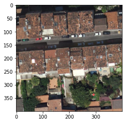
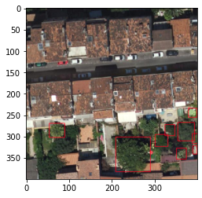

```python
PATCH_SIZE=400
OVERLAP=0.15

GEOTIFF_PATH = "satellite_raster_sample_laplaine_IGN_0.2m-resolution.tif"
```

# Based on case study french Guyana ipython 

see : https://github.com/weecology/DeepForest/blob/master/docs/case_study_FrenchGuiana.md


```python
#Load packages
import numpy as np
from PIL import Image
import os
from matplotlib import pyplot as plt
%matplotlib inline

#Load deepforest
#Optional comet_ml for tracking experiments
# from comet_ml import Experiment
from deepforest import deepforest
from deepforest import preprocess
from deepforest import utilities
from deepforest import __version__
#Geospatial packages
import shapely
import geopandas
import rasterio

#Check version
print("This demo is run with deepforest version {}".format(__version__))
```

    Using TensorFlow backend.
    

    This demo is run with deepforest version 0.3.4
    


```python
raster_path = GEOTIFF_PATH
raster = Image.open(raster_path)
numpy_image = np.array(raster)
numpy_image.shape
```


    (3157, 5182, 4)


```python
# in my case the image has 4 channels, which deepforest complains about
# we drop the alpha channel
numpy_image = numpy_image[:,:,:3]
```


```python
windows = preprocess.compute_windows(numpy_image, patch_size=PATCH_SIZE,patch_overlap=OVERLAP)
```


```python
index = 125
crop = numpy_image[windows[index].indices()]
crop.shape
plt.imshow(crop)
```


    <matplotlib.image.AxesImage at 0x1d1296bbc88>


    

    


```python
# Change from RGB to BGR channel order
# Matplotlib and OpenCV differ in default channel orders. Using Image.open will yield RGB images, whereas keras-retinanet expects BGR images. Flip channel order using numpy.

crop = crop[...,::-1] #keras-retinanet requires bluegreered channel order
```

## Load model 


```python
model = deepforest.deepforest()
model.use_release()
```

    Reading config file: C:\Users\matth\scoop\apps\miniconda3\current\envs\deepforest\lib\site-packages\deepforest\data\deepforest_config.yml
    A blank deepforest object created. To perform prediction, either train or load an existing model.
    Model from DeepForest release https://github.com/weecology/DeepForest/releases/tag/v0.3.0 was already downloaded. Loading model from file.
    Loading pre-built model: https://github.com/weecology/DeepForest/releases/tag/v0.3.0
    WARNING:tensorflow:From C:\Users\matth\scoop\apps\miniconda3\current\envs\deepforest\lib\site-packages\keras\backend\tensorflow_backend.py:4070: The name tf.nn.max_pool is deprecated. Please use tf.nn.max_pool2d instead.
    
    tracking <tf.Variable 'Variable:0' shape=(9, 4) dtype=float32> anchors
    tracking <tf.Variable 'Variable_1:0' shape=(9, 4) dtype=float32> anchors
    tracking <tf.Variable 'Variable_2:0' shape=(9, 4) dtype=float32> anchors
    tracking <tf.Variable 'Variable_3:0' shape=(9, 4) dtype=float32> anchors
    tracking <tf.Variable 'Variable_4:0' shape=(9, 4) dtype=float32> anchors
    WARNING:tensorflow:From C:\Users\matth\scoop\apps\miniconda3\current\envs\deepforest\lib\site-packages\deepforest\keras_retinanet\backend\tensorflow_backend.py:104: add_dispatch_support.<locals>.wrapper (from tensorflow.python.ops.array_ops) is deprecated and will be removed in a future version.
    Instructions for updating:
    Use tf.where in 2.0, which has the same broadcast rule as np.where
    

## Predict


```python
prediction = model.predict_image(numpy_image = crop,return_plot=True, score_threshold=0.05)

```

    WARNING:tensorflow:From C:\Users\matth\scoop\apps\miniconda3\current\envs\deepforest\lib\site-packages\keras\backend\tensorflow_backend.py:422: The name tf.global_variables is deprecated. Please use tf.compat.v1.global_variables instead.
    
    


```python
plt.imshow(prediction[...,::-1]) #show in rgb channel order
```


    <matplotlib.image.AxesImage at 0x1d1226d53c8>


    

    


## Predict entire tile

The overall tile is too large to fit into memory. DeepForest will slide overlapping windows, same as the sized above, make a prediction on each window. Then reassemble and delete overlaps based on the highest scoring box. The reassembling process can be subtle, and requires the user to balance the amount of overlap (more predictions = slower), and the overall size of objects on interest.


```python
tile = model.predict_tile(raster_path,return_plot=True,patch_overlap=0.3,iou_threshold=0.2)
```

    100%|████████████████████████████████████████████████████████████████████████████████| 209/209 [06:06<00:00,  1.75s/it]

    WARNING:tensorflow:From C:\Users\matth\scoop\apps\miniconda3\current\envs\deepforest\lib\site-packages\deepforest\deepforest.py:471: The name tf.Session is deprecated. Please use tf.compat.v1.Session instead.
    
    

    
    

    10 predictions in overlapping windows, applying non-max supression
    9 predictions kept after non-max suppression
    


```python
# display

fig = plt.figure(figsize=(100,100))
plt.imshow(tile)
```


    <matplotlib.image.AxesImage at 0x1d1227ef448>


    

    


```python

```
